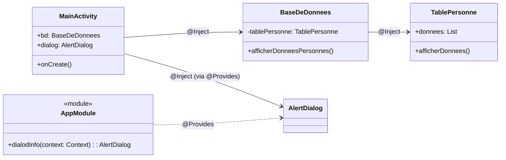

# Third step
## fournir un objet non‑injectable

Diagramme des classes

```mermaid
classDiagram
    direction LR

    class MainActivity {
        +bd: BaseDeDonnees
        +dialog: AlertDialog
        +onCreate()
    }

    class BaseDeDonnees {
        -tablePersonne: TablePersonne
        +afficherDonneesPersonnes()
    }

    class TablePersonne {
        +donnees: List<String>
        +afficherDonnees()
    }

    class AppModule {
        <<module>>
        +dialodInfo(context: Context): AlertDialog
    }

    class AlertDialog

    %% Relations Hilt
    MainActivity --> BaseDeDonnees : @Inject
    MainActivity --> AlertDialog : @Inject (via @Provides)
    BaseDeDonnees --> TablePersonne : @Inject

    %% Module provides
    AppModule ..> AlertDialog : @Provides
```
>[!Info] Information
> - L’injection d’objets non-constructibles
> - Les scopes via @InstallIn